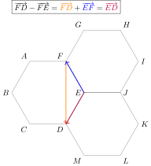
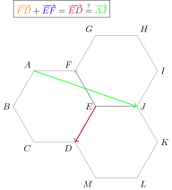
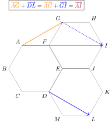
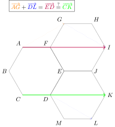
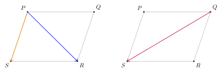
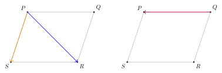

::: {.content-hidden}

\newcommand{\dom}[1]{\text{dom}{\left(#1\right)}}
\newcommand{\IR}{\mathbb{R}}
\newcommand{\e}{\text{e}}
\newcommand{\dx}{\text{d}x}
\newcommand{\IQ}{\mathbb{Q}}
\newcommand{\du}{\text{d}u}
\newcommand{\IC}{\mathbb{C}}
\newcommand{\i}{\textbf{i}}
\newcommand{\?}{\stackrel{?}{=}}

\newcommand{\vect}[1]{\overrightarrow{#1}}
\newcommand{\nv}[1]{\lVert\overrightarrow{#1}\rVert}

:::

## 

::::{.exr nbr="11"}

La figure est composée de trois hexagones réguliers identiques.

{fig-align="center" width=40%}

 Parmi les égalités vectorielles suivantes, une seule est vraie. Laquelle?

:::: {.columns}

::: {.column width="48%"}
⃝ **A**&nbsp;&nbsp;&nbsp;&nbsp; $\vect{FD} - \vect{FE} = \vect{AJ}$

⃝ **C**&nbsp;&nbsp;&nbsp;&nbsp; $\vect{BD} + \vect{FI} = \vect{AJ}$
:::

::: {.column width="48%"}
[✓ **B**&nbsp;&nbsp;&nbsp;&nbsp; $\vect{AG} + \vect{DL} = \vect{CK}$]{style="color:green;"}

⃝ **D**&nbsp;&nbsp;&nbsp;&nbsp; $\vect{AD} - \vect{IH} = \vect{FH}$
:::

::::
::::

## Réponse **A**?

{fig-align="center" width=40%}

## Réponse **A**: NON

{fig-align="center" width=40%}

## Réponse **B**?

{fig-align="center" width=40%}

## Réponse **B**: OUI

{fig-align="center" width=40%}

##

::::{.exr nbr="12"}

Dans le plan muni d'un repère orthonormé, on considère la droite passant par les points $(0;3)$ et $(2;0)$. On considère également une autre droite d'équation $60x+ky+21=0$ où $k$ est un paramètre. 
Pour quelle valeur de $k$ ces deux droites sont-elles perpendiculaires?

:::: {.columns}

::: {.column width="48%"}
[✓ **A**&nbsp;&nbsp;&nbsp;&nbsp; $k=-90$]{style="color:green;"}

⃝ **C**&nbsp;&nbsp;&nbsp;&nbsp; $k=40$
:::

::: {.column width="48%"}
⃝ **B**&nbsp;&nbsp;&nbsp;&nbsp; $k=-40$

⃝ **D**&nbsp;&nbsp;&nbsp;&nbsp; $k=90$
:::

::::
::::

. . .

**Stratégie:** identifier des vecteurs directeurs pour chacune des droites.

. . .

**Rappel:** $d_1$ et $d_2$ sont deux droites. $\vect{v}_1$ et $\vect{v}_2$ sont deux vecteurs directeurs respectifs.

- deux droites $d_1$ et $d_2$ sont perpendiculaires si et seulement si $\vect{v}_1$ et $\vect{v}_2$ sont orthogonaux.

- deux vecteurs $\vect{v}_1$ et $\vect{v}_2$ sont perpendiculaires si et seulement si $\vect{v}_1\cdot \vect{v}_2=0$.

## Calcul des vecteurs directeurs

- La droite passant par $A=(0;3)$ et $B=(2;0)$ a un vecteur directeur qui est $$\vect{AB}=(2-0;0-3)=(2;-3).$$

- Une droite d'équation $ax+by+c=0$ a un vecteur directeur dont les composantes sont $(-b;a)$. Donc un vecteur directeur de la droite d'équation $60x+ky+21=0$ est $\vect{v}=(-k;60)$.

## Calcul du produit scalaire

D'après le rappel, nos deux droites seront perpendiculaires uniquement dans le cas où $\vect{AB}\cdot \vect{v}=0$.

. . .

 Or 

$$
\vect{AB}\cdot \vect{v}=2\cdot(-k)+(-3)\cdot 60=-2k-180.
$$

. . .

Donc 

$$\vect{AB}\cdot \vect{v}=0\Leftrightarrow -2k-180=0\Leftrightarrow-2k=180\Leftrightarrow k=-90.$$

. . .

Donc la bonne réponse est la réponse **A**.

##

::::{.exr nbr="13"}

Dans un repère cartésien orthonormé $Oxy$, considérons la droite $d_1$ d'équation $y=2x-1$ et la droite $d_2$ perpendiculaire à $d_1$ et la coupant au point de coordonnées $(5;9)$.

Quelles sont les coordonnées du point d'intersection de $d_2$ avec l'axe $Oy$? 

:::: {.columns}

::: {.column width="48%"}
⃝ **A**&nbsp;&nbsp;&nbsp;&nbsp; ${\left(0;\frac{19}{2}\right)}$

[✓ **C**&nbsp;&nbsp;&nbsp;&nbsp; ${\left(0;\frac{23}{2}\right)}$]{style="color:green;"}
:::

::: {.column width="48%"}
⃝ **B**&nbsp;&nbsp;&nbsp;&nbsp; ${\left(0;\frac{21}{2}\right)}$

⃝ **D**&nbsp;&nbsp;&nbsp;&nbsp; ${\left(0;\frac{25}{2}\right)}$
:::

::::

::::

. . .

**Stratégie:** Calculer une équation cartésienne de la droite $d_2$. Puis on cherche le point demandé, qui correspond à l'ordonnée à l'origine de la droite.

. . .

**Rappels:** Une droite **non-verticale** à toujours une équation cartésienne de la forme $y=mx+p$ où $m$ est représente la pente et $p$ représente l'ordonnée à l'origine.

. . .

Deux droites **non-verticales** sont perpendiculaires si le produit de leurs pentes vaut $-1$.

## Calcul d'une équation cartésienne de $d_2$.

Comme $d_1\perp d_2$, on sait que le produit de leurs pentes vaut $-1$. Or la pente de $d_1=2$. Notons $m$ la pente de $d_2$. Alors
$2m=-1$. Donc $m=\dfrac{-1}{2}$.

. . .

Donc $d_2\equiv y=\dfrac{-1}{2}x+p$. Comme $(5;9)\in d_2$, on a:

. . .

$$
9=\dfrac{-1}{2}\cdot 5+p.
$$

. . .

Donc $p=9+\dfrac{5}{2}=\dfrac{23}{2}$. Donc $d_2\equiv y=\dfrac{-1}{2}x+\dfrac{23}{2}$. Le point d'intersection entre $d_2$ et $Oy$ est donc $\left(0;\dfrac{23}{2}\right)$.

. . .

La bonne réponse est la réponse **C**.

##

::::{.exr nbr="14"}

Dans le plan muni d'un repère orthonormé, on considère les points $A$ de coordonnées $(2;2)$, $B$ de coordonnées $(8;4)$ et $C$ de coordonnées $(5;8)$. Considérons également le point $H$ correspondant au pied de la hauteur issue de $C$ dans le triangle $ABC$.

Quelles sont les coordonnées de $H$?

:::: {.columns}

::: {.column width="48%"}
[✓ **A**&nbsp;&nbsp;&nbsp;&nbsp; ${\left(\frac{13}{2} ;\frac{7}{2} \right)}$]{style="color:green;"}

⃝ **C**&nbsp;&nbsp;&nbsp;&nbsp; ${\left(5 ;3 \right)}$
:::

::: {.column width="48%"}
⃝ **B**&nbsp;&nbsp;&nbsp;&nbsp; ${\left(\frac{7}{2} ;\frac{13}{2} \right)}$

⃝ **D**&nbsp;&nbsp;&nbsp;&nbsp; ${\left( 6;4 \right)}$
:::

::::

::::

. . .

**Stratégie:** similaire à la question précédente, sachant que la hauteur issue de $C$ est perpendiculaire à $AB$.

{fig-align="center" width=20%}

## Calcul d'équations pour $CH$ et $AB$

- La droite $AB$ est non-verticale et a une équation de la forme $y=mx+p$. 

  - $m=\dfrac{y_B-y_A}{x_B-x_A}=\dfrac{4-2}{8-2}=\dfrac{1}{3}$. Donc $AB\equiv y=\dfrac{1}{3}x+p$
  - comme $A\in AB$, $2=\dfrac{1}{3}\cdot 2+p$. Donc $p=2-\dfrac{2}{3}=\dfrac{4}{3}$.
  - Donc 
      $$  
      AB\equiv y=\dfrac{1}{3}x+\dfrac{4}{3}
      $$

## Calcul d'équations pour $CH$ et $AB$

- La droite $CH$ est non-verticale et a une équation de la forme $y=mx+p$.

  - Comme $CH\perp AB$, $\dfrac{1}{3}m=-1$. Donc $m=-3$. Donc $CH\equiv y=-3x+p$.
  - Comme $C\in CH$, $8=-3\cdot 5+p$. Donc $p=8+15=23$. 
  - Donc 
      $$
      CH\equiv y=-3x+23.
      $$

## Calcul des coordonnées de $H$

$H$ est le point d'intersection des droites $AB$ et $CH$. Donc les coordonnées de $H$ doivent satisfaire simultanément les deux équations trouvées précédemment. 

. . .

Donc pour calculer les coordonnées de $H$, on va résoudre le système:

\begin{cases}
y=-3x+23\\
y=\dfrac{1}{3}x+\dfrac{4}{3}

\end{cases}

. . .

De ce deux équations on a $-3x+23=\dfrac{1}{3}x+\dfrac{4}{3}$. Donc $x=\dfrac{13}{2}$.

. . .

D'après la première équation du système, $y=-3\cdot \dfrac{13}{2}+23=\dfrac{7}{2}$.

. . .

Donc ${\left(\frac{13}{2} ;\frac{7}{2} \right)}$ et la bonne réponse est la réponse **A**.

##

::::{.exr nbr="15"}

On considère quatre points $P$, $Q$, $R$ et $S$ formant un parallélogramme tel que $\vect{PQ}$ a la même direction que $\vect{SR}$ et $\vect{PS}$ a la même direction que $\vect{QR}$.

Parmi les expressions suivantes, quelle est celle qui exprime le vecteur $\vect{QS}-2\vect{PQ}$ comme une combinaison linéaire des vecteurs $\vect{PS}$ et $\vect{PR}$?

:::: {.columns}

::: {.column width="48%"}
⃝ **A**&nbsp;&nbsp;&nbsp;&nbsp; ${3\vect{PS}-4\vect{PR}}$

⃝ **C**&nbsp;&nbsp;&nbsp;&nbsp; ${-3\vect{PS}+4\vect{PR}}$
:::

::: {.column width="48%"}
[✓ **B**&nbsp;&nbsp;&nbsp;&nbsp; ${4\vect{PS}-3\vect{PR}}$]{style="color:green;"}

⃝ **D**&nbsp;&nbsp;&nbsp;&nbsp; ${-4\vect{PS}+3\vect{PR}}$
:::

::::

::::

. . .

**Stratégie:** exprimer $\vect{QS}$ et $\vect{PQ}$ comme des combinaisons linéaires de $\vect{PS}$ et $\vect{PR}$.

{fig-align="center" width=40%}

## Écriture de $\vect{QS}$ comme combili de $\vect{PS}$ et $\vect{PR}$.

{fig-align="center" width=40%}

. . .

Donc $\vect{QS}=\vect{QP}+\vect{PS}$.

## Écriture de $\vect{QP}$ comme combili de $\vect{PS}$ et $\vect{PR}$.

{fig-align="center" width=40%}

##  Écriture de $\vect{QS}-2\vect{PQ}$ comme combili de $\vect{PS}$ et $\vect{PR}$.

. . .

Comme $\vect{QS}=\vect{QP}+\vect{PS}$ et $\vect{PQ}=\vect{PS}-\vect{PR}$,

. . .

$$
\vect{QS}-2\vect{PQ}=\vect{QS}+2\vect{QP}=\vect{QP}+\vect{PS}+2(\vect{PS}-\vect{PR})=4\vect{PS}-3\vect{PR}.
$$

. . .

Donc la bonne réponse est la réponse **B**.

##

::::{.exr nbr="16"}

Dans le plan muni d'un repère orthonormé, on considère les trois droites suivantes : $d_1\equiv y =3x+1$, ${d_2 \equiv y = \frac{x}{2}+1}$ et $d_3 \equiv y=6-2x$. Soient $A$ le point d'intersection de $d_1$ et $d_2$, $B$ le point d'intersection de $d_2$ et $d_3$ et $C$ le point d'intersection de $d_1$ et $d_3$. Que vaut le périmètre du triangle $ABC$? 

:::: {.columns}

::: {.column width="48%"}
⃝ **A**&nbsp;&nbsp;&nbsp;&nbsp; $\sqrt{10}$

[✓ **C**&nbsp;&nbsp;&nbsp;&nbsp; $\sqrt{10}+\sqrt{20}$]{style="color:green;"}
:::

::: {.column width="48%"}
⃝ **B**&nbsp;&nbsp;&nbsp;&nbsp; $\sqrt{5}+\sqrt{10}$

⃝ **D**&nbsp;&nbsp;&nbsp;&nbsp; $\sqrt{20}+\sqrt{40}$
:::

::::

::::

. . .

**Stratégie:** on calcule les coordonnées des points puis les distances entre ces points. Le périmètre cherché est la somme de ces distances.

## Calcul des coordonnées de $A$

On résout le système 
\begin{cases}y=3x+1\\y=\dfrac{1}{2}x+1.\end{cases}

. . .

On a $3x+1=\dfrac{1}{2}x+1$. Donc, $x=0$. De la première équation, on a $y=1$.

. . .

Donc $A=(0;1)$.

## Calcul des coordonnées de $B$

On résout le système 
\begin{cases}y=\dfrac{1}{2}x+1\\y=6-2x.\end{cases}

. . .

On a $\dfrac{1}{2}x+1=6-2x$. Donc, $x=2$. De la deuxième équation, on a $y=2$.

. . .

Donc $B=(2;2)$.

## Calcul des coordonnées de $C$

On résout le système 
\begin{cases}y=6-2x\\y=3x+1.\end{cases}

. . .

On a $6-2x=3x+1$. Donc, $x=1$. De la première équation, on a $y=4$.

. . .

Donc $C=(1;4)$.

## Calcul des distances et du périmètre

$A=(0;1)$, $B=(2;2)$ et $C=(1;4)$.

- $\|AB\|=\sqrt{(2-0)^2+(2-1)^2}=\sqrt{4+1}=\sqrt{5}$
- $\|AC\|=\sqrt{(1-0)^2+(4-1)^2}=\sqrt{1+9}=\sqrt{10}$
- $\|BC\|=\sqrt{(1-2)^2+(4-2)^2}=\sqrt{1+4}=\sqrt{5}$

. . .

Donc le périmètre vaut $P=2\sqrt{5}+\sqrt{10}=\sqrt{20}+\sqrt{10}$.

. . .

Donc la bonne réponse est la réponse **C**.

##

::::{.exr nbr="17"}

Dans le plan muni d'un repère orthonormé, on considère la droite $d_1$ d'équation $y+2x-4=0$ ainsi que la droite $d_2$ perpendiculaire à $d_1$ et passant par le point $A(7;5)$.

Quelles sont les coordonnées du point d'intersection de $d_1$ et $d_2$?

:::: {.columns}

::: {.column width="48%"}
⃝ **A**&nbsp;&nbsp;&nbsp;&nbsp; $(0;3/2)$

⃝ **C**&nbsp;&nbsp;&nbsp;&nbsp; $(-2;1)$
:::

::: {.column width="48%"}
⃝ **B**&nbsp;&nbsp;&nbsp;&nbsp; $(2;1)$

[✓ **D**&nbsp;&nbsp;&nbsp;&nbsp; $(1;2)$]{style="color:green;"}
:::

::::

::::

. . .

**Stratégie:** similaire aux questions 13 et 14.

## Calcul d'une équation pour $d_2$

Comme $d_1\perp d_2$, le produit de leur pentes vaut $-1$. La pente de $d_1$ est $-2$ car:

. . .

$y+2x-4=0\Leftrightarrow y=-2x+4$.

. . .

Donc la pente de $d_2$ vaut $1/2$. Donc $d_2\equiv y=\dfrac{1}{2}x+p$.

. . .

Comme $(7;5)\in d_2$, $5=\dfrac{1}{2}\cdot 7+p$. Donc $p=5-\dfrac{7}{2}=\dfrac{3}{2}$. Donc

$$
d_2\equiv y=\dfrac{1}{2}x+\dfrac{3}{2}.
$$

## Calcul du point d'intersection des deux droites.

On résout le système suivant

\begin{cases}
y=-2x+4\\
y=\dfrac{1}{2}x+\dfrac{3}{2}
\end{cases}

. . .

Des deux équations, on a $-2x+4=\dfrac{1}{2}x+\dfrac{3}{2}$. Donc $x=1$. On sait donc déjà que la réponse est la réponse **D**.

. . .

Donc pour gagner du temps, on peut ne pas calculer pas $y$! Cependant, de la première équation, $y=-2+4=2$. 

##

::::{.exr nbr="18"}

On considère dans le plan quatre points $P$, $Q$, $R$ et $S$ formant un parallélogramme et $M$ le milieu des deux diagonales $PR$ et $QS$.

Quelle est l'égalité correcte parmi les quatre propositions suivantes?

:::: {.columns}

::: {.column width="48%"}
[✓ **A**&nbsp;&nbsp;&nbsp;&nbsp; $\vect{SP} = \vect{MQ}-\vect{MR}$]{style="color:green;"}

⃝ **C**&nbsp;&nbsp;&nbsp;&nbsp; $\vect{SP} = \vect{QM}-\vect{RM}$
:::

::: {.column width="48%"}
⃝ **B**&nbsp;&nbsp;&nbsp;&nbsp; $\vect{SP} = \vect{MR}-\vect{MQ}$

⃝ **D**&nbsp;&nbsp;&nbsp;&nbsp; $\vect{SP} = \vect{RM}-\vect{RQ}$
:::

::::

::::

. . .

**Stratégie:** on teste les différentes proposition, après manipulation des égalités.

{fig-align="center" width=40%}

## Réponse A $\vect{SP} = \vect{MQ}-\vect{MR}$

On a $\vect{MQ}-\vect{MR}=\vect{MQ}+\vect{RM}=\vect{RQ}\?\vect{SP}$.

{fig-align="center" width=40%}

. . .

Donc la bonne réponse est la réponse **A**

## Réponse B $\vect{SP} = \vect{MR}-\vect{MQ}$

On a $\vect{MR}-\vect{MQ}=\vect{MR}+\vect{QM}=\vect{QR}\?\vect{SP}$.

{fig-align="center" width=40%}

. . .

Donc **B** n'est pas la bonne réponse.

##

::::{.exr nbr="19"}

Dans le plan cartésien orthonormé, on considère le parallélogramme de sommets $A(2;1)$, $B(5;4)$, $C(\alpha;\beta)$ et $D(50;3)$, où les constantes $\alpha$ et $\beta$ vérifient $\alpha>50$ et $\beta>4$.

Que vaut $(\alpha;\beta)$?

:::: {.columns}

::: {.column width="48%"}
⃝ **A**&nbsp;&nbsp;&nbsp;&nbsp; $(51;7)$

[✓ **C**&nbsp;&nbsp;&nbsp;&nbsp; $(53;6)$]{style="color:green;"}
:::

::: {.column width="48%"}
⃝ **B**&nbsp;&nbsp;&nbsp;&nbsp; $(52;5)$

⃝ **D**&nbsp;&nbsp;&nbsp;&nbsp; $(57;5)$
:::

::::

::::

. . .

**Stratégie:** On exprime vectoriellement la condition que $ABCD$ est un parallélogramme.

. . .

**Rappel:** $ABCD$ forme un parallélogramme SSI $\vect{AB}=\vect{DC}$ (ou $\vect{AD}=\vect{BC}$ ou ...)

{fig-align="center" width=40%}

## Calcul des vecteurs:

$\vect{AB}=(5-2;4-1)=(3;3)$

$\vect{DC}=(\alpha-50;\beta-3)$

. . .

Donc $\vect{AB}=\vect{DC}\Leftrightarrow(3;3)=(\alpha-50;\beta-3)$.

. . .

Donc $3=\alpha-50$ et $3=\beta-3$. Donc $\alpha=53$ et $\beta=6$.

. . .

La bonne réponse est la réponse **C**.

##

::::{.exr nbr="20"}

Dans le plan muni d'un repère orthonormé, on considère les points $A(2;-1)$, $B(3;4)$ et $C(-4;6)$. Posons $\vec v = 2 \vect{AB} + \vect{BC}$. Parmi les propositions suivantes, laquelle est correcte?

:::: {.columns}

::: {.column width="48%"}
⃝ **A**&nbsp;&nbsp;&nbsp;&nbsp; $\|-7 \vec v \| = 7\sqrt{85}$

⃝ **C**&nbsp;&nbsp;&nbsp;&nbsp; $\|-7 \vec v \| = 14\sqrt{26} +7 \sqrt{53}$
:::

::: {.column width="48%"}
[✓ **B**&nbsp;&nbsp;&nbsp;&nbsp; $\|-7 \vec v \| = 91$]{style="color:green;"}

⃝ **D**&nbsp;&nbsp;&nbsp;&nbsp; $\|-7 \vec v \| = - \sqrt{8~281}$
:::

::::
::::

. . .

**Stratégie:** on calcule les composantes des vecteurs puis la norme demandée.

## Calcul de $\vect{v}$ et de sa norme

- $\vect{AB}=(3-2;4-(-1))=(1;5)$
- $\vect{BC}=(-4-3;6-4)=(-7;2)$
- $\vect{v}=2\vect{AB}+\vect{BC}=2(1;5)+(-7;2)=(2;10)+(-7;2)=(2-7;10+2)=(-5;12)$

. . .

Donc $\|\vect{v}\|=\sqrt{(-5)^2+12^2}=\sqrt{25+144}=\sqrt{169}=13$

. . .

Donc $\|-7\vect{v}\|=7\|\vect{v}\|=7\cdot 13=91$.

. . .

Donc la bonne réponse est la réponse **B**.

